# 🚀 Learn DevOps in 90 Days

### A free, structured, hands-on DevOps learning journey — built for the community

[](https://github.com/aryashreep/learn-devops-in-90-days/stargazers)
[](https://github.com/aryashreep/learn-devops-in-90-days/forks)
[](https://github.com/aryashreep/learn-devops-in-90-days/graphs/contributors)
[](./LICENSE)

> *"DevOps is not about tools. It is about ownership, reliability, and consistency."*

Maintained by **[Aryashree Pritikrishna](https://github.com/aryashreep)**

📚 [Table of Contents](./TABLE-OF-CONTENTS.md) &nbsp; 🤝 [How to Contribute](./CONTRIBUTING.md) &nbsp; ⭐ [Star this Repo](https://github.com/aryashreep/learn-devops-in-90-days)

---

## 🎯 What is This?

**Learn DevOps in 90 Days** is a free, community-driven learning challenge where:

- 📅 Every day has **one clear task**
- 🛠️ Every task produces a **real-world DevOps outcome**
- 💻 Every learner builds a **public GitHub proof of work**
- 🔁 Every concept is reinforced through **hands-on practice**

No endless videos. No passive learning.
**This is a discipline + execution challenge.**

---

## ✨ What You Will Build Over 90 Days

| 🏆 Outcome | Details |
|---|---|
| 💪 Strong fundamentals | Linux, Git, Python, Networking |
| 🐳 Container fluency | Docker, Kubernetes, Helm, ArgoCD |
| ☁️ Cloud confidence | AWS core and advanced services |
| 🔄 CI/CD pipelines | Jenkins, GitHub Actions, GitLab CI |
| 🔒 Security mindset | DevSecOps, image scanning, secrets management |
| 📊 Observability skills | Prometheus, Grafana, OpenTelemetry |
| 🏗️ Real projects | 5 capstone projects for your portfolio |
| 📁 GitHub profile | 90 days of consistent public commits |

---

## 🗺️ Learning Roadmap

```
🐧 Linux  →  🐙 Git  →  🐍 Python  →  🐳 Docker  →  🔧 Jenkins
                              ↓
    ☸️ Kubernetes  →  ☁️ AWS  →  ⚙️ Ansible  →  🏗️ Terraform
                              ↓
       📊 Observability  →  🔒 DevSecOps  →  🚀 Capstone
```



```mermaid id="y9f9vh"
flowchart LR

subgraph Foundations
    P1["🐧 Foundation<br/>Linux<br/>Shell Scripting<br/>Networking"]
    P2["🐙 Version Control<br/>Git<br/>GitHub"]
end

subgraph DevOps_Core
    P3["🐍 Scripting<br/>Python for DevOps"]
    P4["🐳 Containers<br/>Docker"]
    P5["🔧 CI/CD<br/>Jenkins<br/>GitHub Actions"]
end

subgraph Infrastructure_Cloud
    P6["☁️ Cloud Engineering<br/>AWS<br/>Cloud Fundamentals"]
    P7["⚙️ Configuration Management<br/>Ansible<br/>Automation"]
    P8["🏗️ Infrastructure as Code<br/>Terraform<br/>IaC"]
end

subgraph Platform_Operations
    P9["☸️ Orchestration<br/>Kubernetes<br/>Helm<br/>ArgoCD"]
    P10["📊 Observability & Monitoring<br/>Prometheus<br/>Grafana<br/>Logging"]
end

subgraph Security
    P11["🔒 DevSecOps<br/>Security<br/>Scanning<br/>Secure CI/CD"]
end

subgraph Projects
    P12["🚀 Capstone Projects<br/>End-to-End Projects<br/>Real-World Deployments"]
end

P1 --> P2
P2 --> P3
P3 --> P4
P4 --> P5
P5 --> P6
P6 --> P7
P7 --> P8
P8 --> P9
P9 --> P10
P10 --> P11
P11 --> P12
```

## 🗺️ DevOps Learning Phases

### 🟢 Phase 1 — Foundations

Build strong fundamentals required for every DevOps engineer.

```text
🐧 Linux  →  🐙 Git  →  🐍 Python
```

### Topics Covered

* Linux basics and administration
* Shell scripting
* Networking fundamentals
* Git and GitHub workflows
* Python for automation

### Goal

Develop strong command-line, scripting, and version control skills.

---

### 🟡 Phase 2 — DevOps Core

Learn the most important DevOps tools and workflows used in modern engineering teams.

```text
🐳 Docker  →  🔧 Jenkins  →  ☸️ Kubernetes
```

### Topics Covered

* Containerization with Docker
* CI/CD pipelines
* Jenkins automation
* Kubernetes orchestration
* Helm and ArgoCD basics

### Goal

Understand automation, deployment pipelines, and container orchestration.

---

### 🔵 Phase 3 — Cloud, IaC & Production Engineering

Learn infrastructure automation, monitoring, security, and real-world production practices.

```text
☁️ AWS  →  ⚙️ Ansible  →  🏗️ Terraform
                ↓
📊 Observability  →  🔒 DevSecOps  →  🚀 Capstone
```

### Topics Covered

* AWS cloud fundamentals
* Infrastructure as Code (Terraform)
* Configuration management (Ansible)
* Monitoring and observability
* DevSecOps practices
* Real-world capstone projects

Full day-by-day breakdown → [📚 TABLE-OF-CONTENTS.md](./TABLE-OF-CONTENTS.md)

---

## 🧠 Who Is This For?

| 👤 Profile | Why This Fits |
|---|---|
| 🎓 Students and freshers | Structured path from zero to job-ready |
| 💼 Working professionals | Switch to DevOps / SRE / Cloud roles |
| 👨‍💻 Developers | Understand infrastructure, CI/CD, and automation |
| 🔁 Career changers | Consistent daily practice builds momentum |
| ☁️ Cloud Learners        | Gain hands-on platform engineering exposure |

**No prior DevOps experience required. Commitment is the only prerequisite.**

---

## 📁 Repository Structure

> **Note:** Directories marked with `(planned)` will be added as the project grows.

```
learn-devops-in-90-days/
│
├──📄README.md              ← You are here
├──📚TABLE-OF-CONTENTS.md   ← Full index of all 90 days
├──🤝CONTRIBUTING.md        ← How to contribute
├──📜LICENSE
│
├── 📂 content/                   ← All 90 day folders live here
│    ├── day-01/
│    │   └── README.md
│    ├── day-02/
│    │   └── README.md
│    ├── ...
│    └── day-90/
│        └── README.md
│
├── 📂 resources/                 ← Additional learning resources
│
├── 📂 scripts/ (planned)        ← Helper scripts
│   ├── setup.sh
│   ├── lint.sh
│   └── cleanup.sh
│
├── 📂 projects/ (planned)       ← Real-world capstone projects
│   ├── project-01-dockerized-app/
│   ├── project-02-ci-cd-pipeline/
│   ├── project-03-kubernetes-deployment/
│   ├── project-04-terraform-aws/
│   └── project-05-observability-stack/
│
├── 📂 .github/ (planned)
│   ├── workflows/                ← GitHub Actions CI/CD
│   ├── ISSUE_TEMPLATE/
│   └── PULL_REQUEST_TEMPLATE.md
│
├── 📂 templates/ (planned)      ← Reusable templates
├── 📂 docs/ (planned)           ← Advanced documentation
└── 📂 examples/ (planned)       ← Sample configurations/examples
```

---

## ⚡ Quick Start — 5 Steps

```bash
# 1️⃣  Fork this repository (click Fork button top-right on GitHub)

# 2️⃣  Clone your fork
git clone https://github.com/<your-username>/learn-devops-in-90-days.git
cd learn-devops-in-90-days

# 3️⃣  Go to today's folder
cd content/day-01

# 4️⃣  Read the task, complete it, write your notes

# 5️⃣  Commit and push your progress
git add .
git commit -m "day-01: what is devops — notes and task complete"
git push origin main
```

---

## 📅 How the Challenge Works

| Day | Focus |
|---|---|
| 🗓️ Monday – Friday | Core concept + hands-on task |
| 🛠️ Saturday | Practice, revision, or mini project |
| 😴 Sunday | Rest or catch up — you earned it |

Even **30–60 minutes per day** done consistently beats 5-hour weekend binges.

---

## 📊 Phase Tracker

| Phase | Days | Topics | Status |
|---|---|---|---|
| 🐧 Foundation | 01–07 | Linux, Shell Scripting, Networking | 🟢 In Progress |
| 🐙 Version Control | 08–12 | Git and GitHub | 🟡 Planned |
| 🐍 Scripting | 13–15 | Python for DevOps | 🟡 Planned |
| 🐳 Containers | 16–21 | Docker | 🟡 Planned |
| 🔧 CI/CD | 22–29 | Jenkins | 🟡 Planned |
| ☸️ Orchestration | 30–37 | Kubernetes, Helm, ArgoCD | 🟡 Planned |
| ☁️ Cloud | 38–53 | AWS | 🟡 Planned |
| ⚙️ Config Management | 54–59 | Ansible | 🟡 Planned |
| 🏗️ IaC | 60–71 | Terraform | 🟡 Planned |
| 📊 Observability | 72–79 | Prometheus and Grafana | 🟡 Planned |
| 🔒 DevSecOps | 80–84 | Security in CI/CD | 🟡 Planned |
| 🚀 Capstone | 85–90 | End-to-end Projects | 🟡 Planned |

---

## 🌍 Share Your Progress

Show up publicly. Tag your posts on LinkedIn:

```
#LearnDevOpsIn90Days   #DevOps   #90DaysOfDevOps
#OpenSource            #LearningInPublic
```

Connect: **[Aryashree Pritikrishna on GitHub](https://github.com/aryashreep)**

---

## 🤝 Contributing

This repository is built **by the community, for the community.**

Whether you are fixing a typo, adding notes, or sharing your task solution — **every contribution counts.**

👉 Read [CONTRIBUTING.md](./CONTRIBUTING.md) before raising a pull request.

---

## ⭐ Support This Project

If this repository helped you today:

- ⭐ **Star it** so others can discover it
- 🍴 **Fork it** and start your 90-day journey
- 📣 **Share it** with a friend learning DevOps
- 🤝 **Contribute** a fix, a note, or an improvement

---

# 🚀 What You Will Build

| 🏆 Outcome                    | Details                               |
| ----------------------------- | ------------------------------------- |
| 💪 Linux & Networking Skills  | CLI, shell scripting, troubleshooting |
| 🐙 Git & GitHub Mastery       | Branching, PRs, workflows             |
| 🐍 Python Automation          | DevOps scripting fundamentals         |
| 🐳 Docker Expertise           | Containerization and image workflows  |
| ☸️ Kubernetes Skills          | Deployments, services, Helm, ArgoCD   |
| ☁️ AWS Cloud Knowledge        | Core and advanced cloud services      |
| ⚙️ Infrastructure as Code     | Terraform and automation              |
| 🔄 CI/CD Pipelines            | Jenkins, GitHub Actions, GitLab CI    |
| 📊 Monitoring & Observability | Prometheus, Grafana, OpenTelemetry    |
| 🔒 DevSecOps Practices        | Security scanning and best practices  |
| 🏗️ Real Projects             | Portfolio-ready capstone projects     |
| 📁 GitHub Consistency         | 90 days of public contributions       |

---

# 💼 Career Paths After Completion

This roadmap helps prepare learners for roles such as:

* DevOps Engineer
* Site Reliability Engineer (SRE)
* Platform Engineer
* Cloud Engineer
* Infrastructure Engineer
* Kubernetes Engineer
* Automation Engineer
* CI/CD Engineer
* DevSecOps Engineer

---

# 🔥 Recommended Certifications

This roadmap complements certifications such as:

* AWS Certified Cloud Practitioner
* AWS Solutions Architect Associate
* Certified Kubernetes Administrator (CKA)
* Terraform Associate
* Docker Certified Associate
* Certified DevOps Engineer

---

### Goal

Become capable of building, automating, securing, and monitoring production-grade infrastructure.

---

**One day at a time. One commit at a time.**

Made with ❤️ by [Aryashree Pritikrishna](https://github.com/aryashreep) and the community
